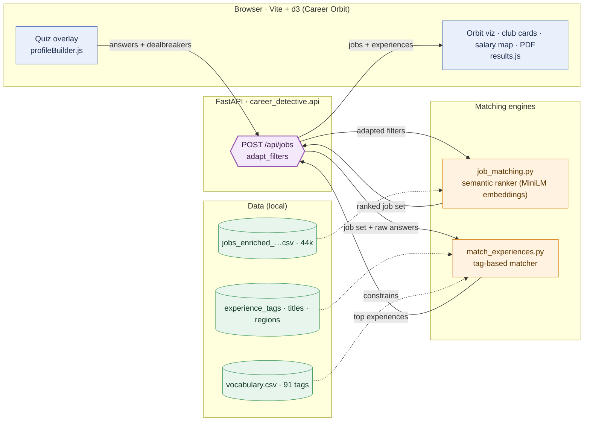
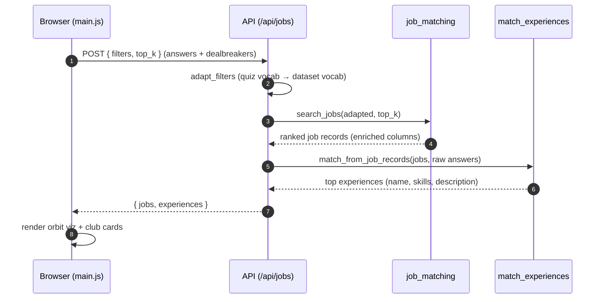

# System architecture: quiz → jobs + experiences → orbit UI

How a short career quiz becomes **ranked real jobs** *and* **matched TUM
experiences**, rendered in an interactive orbit visualization. One HTTP API sits
in front of **two different matching engines** — a semantic job ranker and a
tag-based experience matcher.

For the offline data side (how the experience tables and vocabulary are built),
see the [data pipeline](data-pipeline.md). For why club suggestions are
diversified, see [diversity & transferable skills](diversity-and-transferable-skills.md).

---

## 1. At a glance



**Reading it** — blue = the browser app · purple = the API seam · orange = the
two matching engines · green = local data. A single request fans out to the job
ranker, then feeds *those* jobs into the experience matcher, and returns both in
one payload. The API is the only place the two engines meet.

---

## 2. The request lifecycle

One quiz submission is a four-stage round trip.



**Stage 1 — Quiz & profile (frontend).** The quiz overlay
([profileBuilder.js](../src/profileBuilder.js)) collects seven answers — title,
domain, country, company size, work format, experience level, education level —
each with a **`dealBreaker`** flag. `formatProfileForApi` shapes them into the
`{field: {data, dealBreaker}}` contract; [apiService.js](../src/apiService.js)
POSTs them to `/api/jobs`.

**Stage 2 — Adapt & rank jobs.** [api.py](../src/career_detective/api.py)
`adapt_filters` translates quiz vocabulary into the job dataset's vocabulary
(e.g. `micro/startup → small`, `onsite → in-person`) and **drops** values with
no honest equivalent rather than mis-scoring them. `search_jobs`
([job_matching.py](../src/career_detective/job_matching.py)) then ranks the 44k
enriched postings and returns the top *k*.

**Stage 3 — Match experiences to those jobs.** The API calls
`match_from_job_records` ([match_experiences.py](../scripts/match_experiences.py))
on the *jobs that were just returned*, so experiences are matched to the actual
result set, not the whole corpus. It passes the **raw** answer set (not the
adapted one) so intent like `country=Japan` survives to reach cultural clubs —
`adapt_filters` would have dropped it.

**Stage 4 — Respond & render.** The API returns `{ jobs, experiences }` (see the
[JSON contract](match-json.md)). [main.js](../src/main.js) renders the orbit
visualization, job cards, and **club cards** — each showing the experience's
name, skills, and description. If the API is unreachable, jobs fall back to a
client-side estimate and **no clubs are shown** (never fabricated).

---

## 3. Two engines, two philosophies

The job and experience sides match on deliberately different principles.

| | **Jobs** (`job_matching.py`) | **Experiences** (`match_experiences.py`) |
| --- | --- | --- |
| Method | **Semantic** — MiniLM sentence embeddings | **Lexical** — controlled-vocabulary tag joins |
| Where it fits | title & domain are free text → embed & cosine | experiences are pre-tagged → exact idf-weighted coverage |
| Other fields | exact/alias match (country, company size, …) | five weighted fields + preference modulation |
| Hard vs soft | dealbreakers **exclude**; soft filters **rank** | dealbreakers **reserve a slot** + stronger boost |
| Strength | catches meaning the tags miss | high precision + a crisp "matched via X, Y" explanation |
| Cost | ~89 s cold (corpus encode), then cached (~0.4 s) | ~0.14 s per request |

This asymmetry is intentional: embeddings give the job side recall over messy
free text, while the tag join keeps the experience side interpretable (a student
sees *why* a club fits). A future **embedding hybrid** on the experience side —
fusing tag scores with description-level semantics — is sketched as Layer 3 in
[diversity & transferable skills](diversity-and-transferable-skills.md#layer-3--semantic-hybrid-optional).

---

## 4. Where everything lives

| Layer | File | Role |
| --- | --- | --- |
| Frontend | [`src/main.js`](../src/main.js) | app flow: quiz → fetch → render |
| | [`src/profileBuilder.js`](../src/profileBuilder.js) | quiz + `formatProfileForApi` |
| | [`src/apiService.js`](../src/apiService.js) | `fetchJobMatches` → `POST /api/jobs` |
| | [`src/dataService.js`](../src/dataService.js) | client-side market data + fallback |
| | [`src/results.js`](../src/results.js) | results page (jobs, club cards) |
| | `src/planet.js` · `salaryMap.js` · `charts.js` · `antigravity.js` | d3 orbit + map viz |
| API | [`src/career_detective/api.py`](../src/career_detective/api.py) | `/api/jobs`, `adapt_filters`, `/health` |
| Job engine | [`src/career_detective/job_matching.py`](../src/career_detective/job_matching.py) | semantic ranking + risk formula |
| Experience engine | [`scripts/match_experiences.py`](../scripts/match_experiences.py) | tag matcher + `match_from_job_records` bridge |
| Offline pipeline | `scripts/build_*.py`, `scripts/tag_experiences_*.py` | build vocabulary, experiences, tags (see [data pipeline](data-pipeline.md)) |

---

## 5. Data dependencies (runtime)

The API needs these present locally (most are gitignored and regenerated):

- **Job ranking**: `data/cleaned/jobs_enriched_with_layoffs_complete.csv` (44k
  postings with layoff/risk enrichment) + the MiniLM model (auto-downloaded once).
- **Experience matching**: `data/processed/experience_tags.csv`,
  `experience_job_titles.csv`, `experience_regions.csv`,
  `tum_student_experiences.csv`, `jobs.csv`, `job_tags.csv`, and
  `data/reference/vocabulary.csv` — all produced by the offline
  [data pipeline](data-pipeline.md).
- **Frontend globe**: `public/data/*.csv` (country/industry summaries) loaded
  directly by the browser for the market visualization.

The experience matcher runs **no model at request time** — the embeddings on its
side (title grounding via `nomic-embed-text`) happen offline during tagging.

---

## 6. Running it locally

```bash
# backend — FastAPI on :8000
just api

# frontend — Vite on :5173, proxies /api → :8000
npm install        # once (the committed node_modules was partial)
npm run dev
```

Open [localhost:5173](http://localhost:5173) and take the quiz. Vite's dev proxy forwards
`/api` to the backend, so no CORS setup is needed.

> **Cold start:** the first request per backend boot spends ~89 s encoding the
> 44k job corpus (MiniLM), then every request is sub-second (the corpus
> embeddings are cached for the process). Precomputing/persisting those vectors
> is the standing fix.

---

## 7. Deeper dives

- [Data pipeline](data-pipeline.md) — raw TUM sources → tagged experience schema.
- [Diversity & transferable skills](diversity-and-transferable-skills.md) — why
  and how club suggestions are de-homogenized.
- [Match JSON contract](match-json.md) — the `{ jobs, experiences }` payload and
  the `match_from_job_records` bridge.
