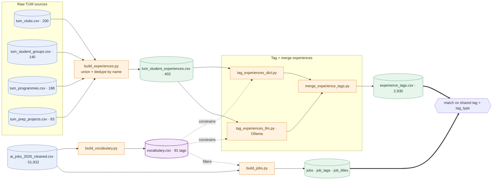
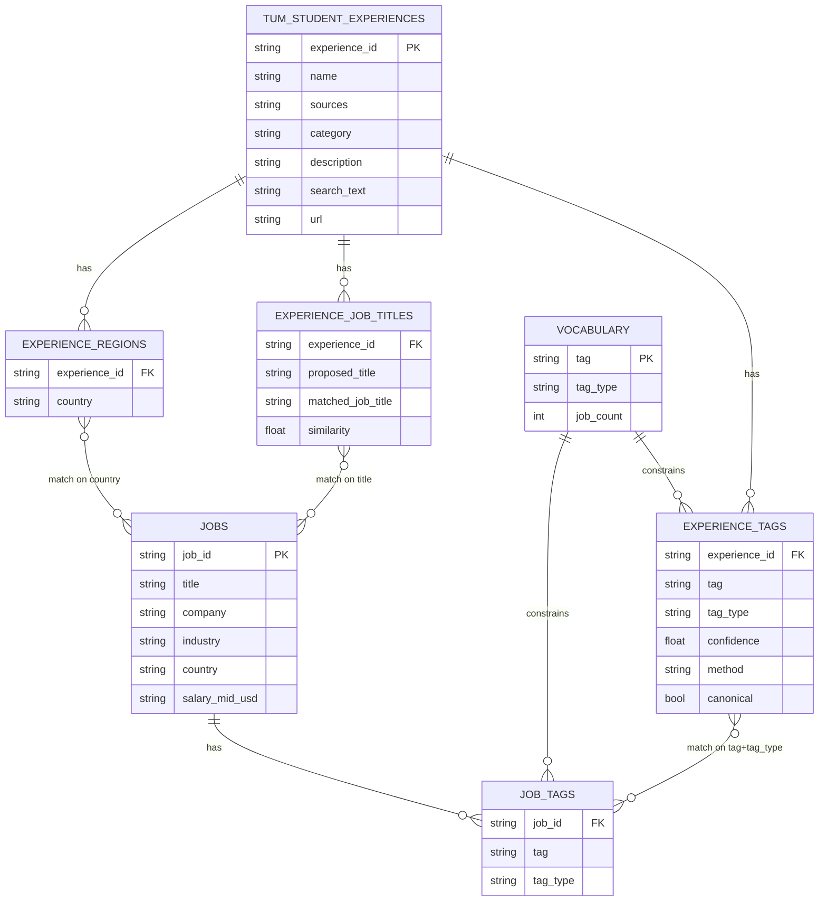

# Data pipeline: raw TUM sources → experience schema

How four scraped TUM datasets become one standardized, tagged **experience** schema
that matches student clubs / programmes / research projects to AI-tech jobs.

The whole thing regenerates with **`just data`** (+ `just tag-llm` for the
local-LLM step). See the [README](../README.md#data-pipeline) for commands.

---

## 1. At a glance



**Reading it** — cylinders are data files, rectangles are scripts. Blue = raw
inputs · orange = pipeline scripts · green = output tables · purple = the shared
**vocabulary** (the join key) · hexagon = the match step. The vocabulary
constrains both tagging passes *and* the jobs export, so `experience_tags` and
`job_tags` land in the same tag space and join directly — an exact join, not
fuzzy NLP.

---

## 2. Consolidating the raw TUM sources

The four sources overlap heavily but none is a superset — programmes covers only
**72/200** clubs, so all four are **unioned and deduped by normalized name**
rather than treating any one as canonical.

| Source | Rows | Key columns |
| --- | --- | --- |
| `tum_clubs.csv` | 200 | name, description, **focus_areas** |
| `tum_student_groups.csv` | 140 | name, description |
| `tum_programmes.csv` | 188 | sub-program, program, description, **tags** |
| `tum_prep_projects.csv` | 83 | project_name, department, keyword, research_area, chair_institute, student_background, further_disciplines, description |

**Field folding.** Every skill/industry-relevant field is concatenated into one
`search_text` field, so the downstream tagging reads a single field and nothing
is missed:

| Source | Folded into `search_text` |
| --- | --- |
| clubs | name · description · focus_areas |
| groups | name · description |
| programmes | sub-program · program · description · tags |
| prep | project_name · department · keyword · research_area · chair_institute · student_background · further_disciplines · description |

Result — `tum_student_experiences.csv` (402 rows; 137 appear in >1 source):

```text
experience_id    slug of the name (PK)
name         display name
sources      provenance, e.g. "clubs|groups|programmes"
category     best-effort (programme category / focus area / dept)
description  longest description across sources
search_text  all folded text — the field tagging reads
url          first non-empty link
```

---

## 3. Tagging experiences

Two passes write to long/tidy tag tables. Both reference `vocabulary.csv`
(`tag, tag_type, job_count`), whose `tag_type` ∈ `skill | language |
specialization | industry`.

- **`tag_experiences_dict.py`** → `experience_tags_dict.csv` — high-precision
  **verbatim** matches of canonical terms (`method=dict`, `confidence=1.0`).
- **`tag_experiences_llm.py`** → `experience_tags_llm.csv` — **inferential** local-LLM
  tags: a robotics club yields ROS / Control Systems even if unstated
  (`method=llm`). Also emits `experience_job_titles.csv`.

```text
experience_tags_dict   experience_id, tag, tag_type, confidence, method, canonical
experience_tags_llm    experience_id, tag, tag_type, method, canonical
experience_job_titles  experience_id, proposed_title, matched_job_title, similarity
```

`canonical = True` means the tag is in the vocabulary (joins to jobs);
`False` is an open enrichment term (ROS, "Culture & the Arts"). Current split is
~70 % canonical / 30 % open.

Job titles are kept **separate** because titles are *not* a controlled
vocabulary — they are free-text LLM proposals fuzzy-mapped to the 37 real job
titles, so they don't fit the `(tag, tag_type)` shape.

---

## 4. The schema



An experience matches a job by **overlap of shared canonical `(tag, tag_type)`**;
`jobs` supplies salary / geography / demand context.

---

## 5. Why it's shaped this way

- **Dimension + long tag tables, not one wide table.** The four sources have
  very different columns; a wide table would be mostly NULLs. Long tables
  (`experience_id, tag, tag_type`) are the tidy form that powers filtering and joins.
- **Union, not "pick the richest source".** programmes misses 128/200 clubs, so
  every source contributes; `sources` records where each experience came from.
- **One `search_text` field** guarantees the tagger sees every relevant signal
  from every source in one place.
- **`canonical` flag = the hybrid vocabulary decision** — canonical tags join to
  jobs, open tags enrich the profile without forcing everything into an AI/ML
  taxonomy.
- **Split tag tables by `method`** (dict vs llm) preserve provenance and trust;
  `merge_experience_tags.py` combines them into a single `experience_tags`.

---

## 6. Unified tags — `experience_tags.csv`

`merge_experience_tags.py` (`just merge-tags`) merges the dict + llm passes,
deduped on `(experience_id, tag, tag_type)` (case-insensitive on the tag):

```text
experience_id, tag, tag_type, confidence, method, canonical
```

- **`confidence`** reconciled: verbatim dict = `1.0`, LLM-only = `0.7`.
- **`method`** = `dict` | `llm` | `both` (found by both passes → keeps `1.0`).
- Runs with the dict pass alone if the LLM output isn't present.

## 7. Matching — `match_experiences.py`

Given a set of N jobs, `match_experiences.py` (`just match`) ranks the
experiences and returns the top M. The job set is pooled into one profile
(collective centroid) and scored on **five weighted fields**, kept separate so
the weights can be re-tuned:

| Field | Compares | Signal |
| --- | --- | --- |
| **skills** (`0.55`) | experience `skill/language/specialization` tags ↔ job skills | idf-weighted **coverage** (dot with the job profile, normalized) — covering the jobs' specific skills beats a couple of generic aligned tags |
| **title** (`0.17`) | `experience_job_titles.matched_job_title` ↔ the set's `jobs.title` | title-set overlap |
| **transversal** (`0.13`) | experience `transversal` tags (transferable skills) | universal prior — job-independent; lifts non-tech clubs off zero (see below) |
| **industry** (`0.08`) | experience `industry` tags ↔ the set's `jobs.industry` | cosine (coarse tiebreaker) |
| **geo** (`0.07`) | `experience_regions.country` ↔ the set's `jobs.country` | fraction of jobs whose country matches — sparse, only fires for cultural clubs |

`score = Σ wᵢ·simᵢ`, skills-forward. Only canonical tags join; idf down-weights
ubiquitous tags (Python is on 49,918 jobs) so rare skills discriminate. A
**skills floor** drops experiences with ~zero skill overlap from the main list.
Because scores are sums over shared tags, the top contributing tags are reported
per match — the join key doubles as the explanation. Results are **MMR-selected
for diversity, then shown in score order**; `--broaden N` adds an opt-in,
transversal-forward *broaden your profile* lane — see
[diversity-and-transferable-skills.md](diversity-and-transferable-skills.md).

- **Transversal** is the fix for STEM-homogeneous results — since the tech-only
  vocabulary makes non-tech clubs score ≈ 0, a transferable-skills axis
  (universal prior) gives them a real, modest score. Full write-up:
  [diversity-and-transferable-skills.md](diversity-and-transferable-skills.md).
- **Career preferences** (`--prefs`, a JSON profile with `dealBreaker` flags)
  sharpen the experience search *without touching the job set*: value-match
  answers (country, education=PhD, domain) **multiply** the relevance of aligned
  experiences — so a preference only helps an *already-relevant* club (skills
  stay at the forefront), rather than floating a zero-skill cultural club to the
  top. Heuristic answers (small company → soft skills, senior level) reshape the
  field weights. A `dealBreaker` applies the stronger coefficient **and reserves
  a guaranteed slot** — so a Japanese culture club (no tech skills, normally
  floored out) still appears for a `country=Japan` dealbreaker, because it's
  non-negotiable. The `boosted` line shows which preferences fired.
- **Titles** are matched to the 37 real titles by *semantic* embedding
  similarity (`nomic-embed-text`), so "Aerospace Engineer" stays unmatched
  rather than collapsing onto "Prompt Engineer".
- **Geo** is a deliberate low-weight tiebreaker: `experience_regions` is empty
  for ~all experiences, so it only ever helps the small cultural-club subset
  when the job set includes their country.
