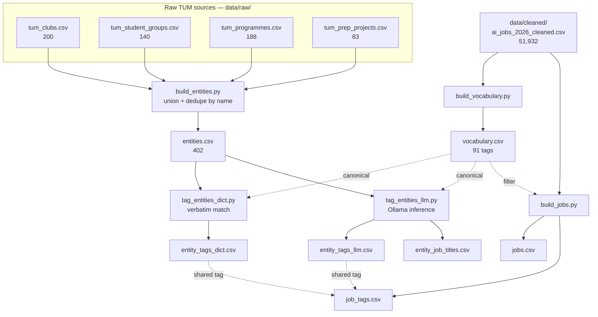
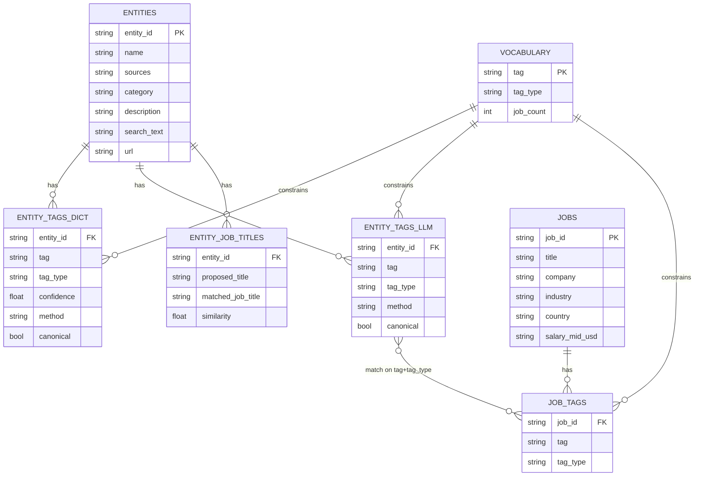

# Data pipeline: raw TUM sources → entity schema

How four scraped TUM datasets become one standardized, tagged **entity** schema
that matches student clubs / programmes / research projects to AI-tech jobs.

The whole thing regenerates with **`just data`** (+ `just tag-llm` for the
local-LLM step). See the [README](../README.md#data-pipeline) for commands.

---

## 1. At a glance



The **vocabulary** is the linchpin: the TUM side and the jobs side draw tags
from the *same* controlled set, so matching is an exact join, not fuzzy NLP.

---

## 2. Consolidating the raw TUM sources

The four sources overlap heavily but none is a superset — programmes covers only
**72/200** clubs, so all four are **unioned and deduped by normalized name**
rather than treating any one as canonical.

| Source | Rows | Key columns |
| --- | --- | --- |
| `tum_clubs.csv` | 200 | name, description, **focus_areas** |
| `tum_student_groups.csv` | 140 | name, description |
| `tum_programmes.csv` | 188 | sub-program, program, description, **tags** |
| `tum_prep_projects.csv` | 83 | project_name, department, keyword, research_area, chair_institute, student_background, further_disciplines, description |

**Field folding.** Every skill/industry-relevant field is concatenated into one
`search_text` field, so the downstream tagging reads a single field and nothing
is missed:

| Source | Folded into `search_text` |
| --- | --- |
| clubs | name · description · focus_areas |
| groups | name · description |
| programmes | sub-program · program · description · tags |
| prep | project_name · department · keyword · research_area · chair_institute · student_background · further_disciplines · description |

Result — `entities.csv` (402 rows; 137 appear in >1 source):

```text
entity_id    slug of the name (PK)
name         display name
sources      provenance, e.g. "clubs|groups|programmes"
category     best-effort (programme category / focus area / dept)
description  longest description across sources
search_text  all folded text — the field tagging reads
url          first non-empty link
```

---

## 3. Tagging entities

Two passes write to long/tidy tag tables. Both reference `vocabulary.csv`
(`tag, tag_type, job_count`), whose `tag_type` ∈ `skill | language |
specialization | industry`.

- **`tag_entities_dict.py`** → `entity_tags_dict.csv` — high-precision
  **verbatim** matches of canonical terms (`method=dict`, `confidence=1.0`).
- **`tag_entities_llm.py`** → `entity_tags_llm.csv` — **inferential** local-LLM
  tags: a robotics club yields ROS / Control Systems even if unstated
  (`method=llm`). Also emits `entity_job_titles.csv`.

```text
entity_tags_dict   entity_id, tag, tag_type, confidence, method, canonical
entity_tags_llm    entity_id, tag, tag_type, method, canonical
entity_job_titles  entity_id, proposed_title, matched_job_title, similarity
```

`canonical = True` means the tag is in the vocabulary (joins to jobs);
`False` is an open enrichment term (ROS, "Culture & the Arts"). Current split is
~70 % canonical / 30 % open.

Job titles are kept **separate** because titles are *not* a controlled
vocabulary — they are free-text LLM proposals fuzzy-mapped to the 37 real job
titles, so they don't fit the `(tag, tag_type)` shape.

---

## 4. The schema



An entity matches a job by **overlap of shared canonical `(tag, tag_type)`**;
`jobs` supplies salary / geography / demand context.

---

## 5. Why it's shaped this way

- **Dimension + long tag tables, not one wide table.** The four sources have
  very different columns; a wide table would be mostly NULLs. Long tables
  (`entity_id, tag, tag_type`) are the tidy form that powers filtering and joins.
- **Union, not "pick the richest source".** programmes misses 128/200 clubs, so
  every source contributes; `sources` records where each entity came from.
- **One `search_text` field** guarantees the tagger sees every relevant signal
  from every source in one place.
- **`canonical` flag = the hybrid vocabulary decision** — canonical tags join to
  jobs, open tags enrich the profile without forcing everything into an AI/ML
  taxonomy.
- **Split tag tables by `method`** (dict vs llm) preserve provenance and trust;
  they are merged into a single `entity_tags` in step 6.

---

## 6. Not yet built (step 6+)

- A unified `entity_tags` (merge dict + llm, dedupe on `entity_id, tag,
  tag_type`; reconcile the `confidence` column — present on dict, absent on llm).
- Entity ↔ job matching on shared canonical tags, ranked and enriched with
  `jobs` fields.
