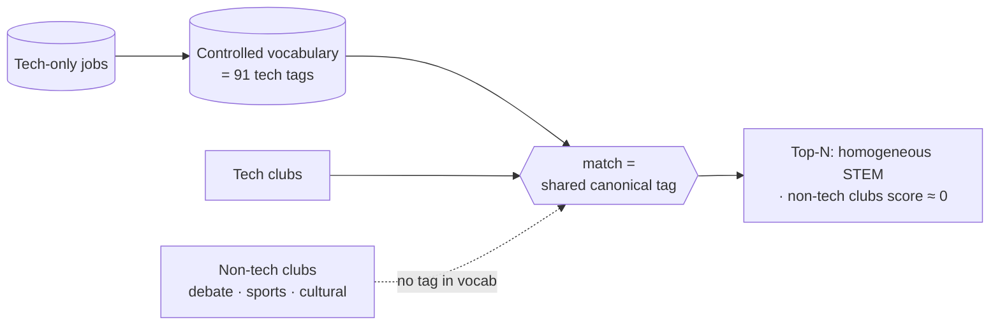
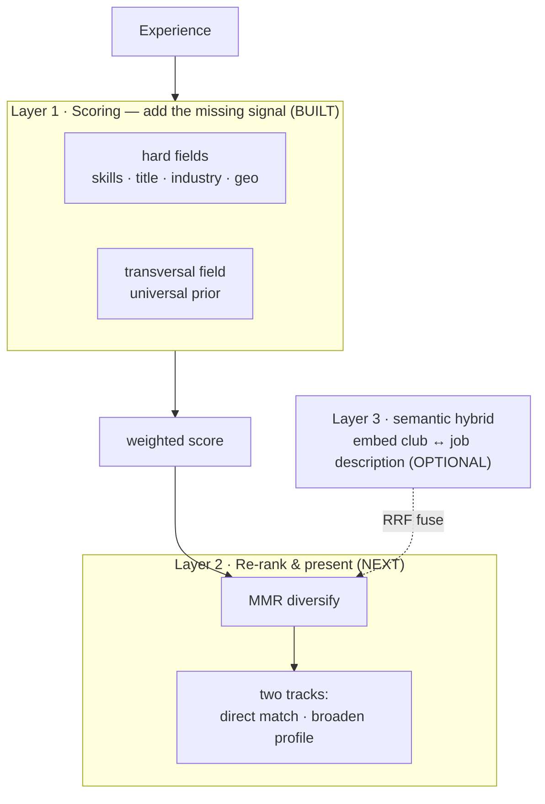

# Club-suggestion diversity & transferable skills

How the matcher's STEM-homogeneity problem arises, and the layered solution we
adopted. Written up for a report; the design is reflected in
`match_experiences.py` (Layer 1) and the [data pipeline](data-pipeline.md).

## 1. The problem

The job dataset is **entirely AI/tech roles**, so the controlled `vocabulary`
(91 tags) is entirely technical. Matching joins an experience to jobs on
**shared canonical tags**, which produces two coupled failures:

1. **Missing signal (vocabulary bias).** A debate club's real value — public
   speaking, argumentation, teamwork — has *no canonical tag to join on*. It
   scores ≈ 0, not because it's irrelevant, but because the model is blind to
   transferable skills. The jobs don't list soft skills either, so the axis is
   absent on **both** sides.
2. **List homogeneity.** Even among genuinely relevant clubs, pure-relevance
   ranking returns near-duplicates (five similar ML clubs) — the classic
   relevance-vs-diversity tradeoff.

The result *looks* wrong (homogeneous, non-tech clubs ignored) but is
*mathematically correct* — it's the expected output of optimising pure
relevance over a biased vocabulary.



## 2. Solution — a layered mix

The fixes are not alternatives; they **stack** as three layers. We build them
in order of value-for-effort, given the product goal (*well-rounded guidance*
for a student pursuing tech, not just "skills for this exact job").



### Layer 1 — transferable-skills axis (built)

The foundational fix: give clubs a signal for what they actually build.

- **Taxonomy.** A small controlled set of **transversal (transferable) skills**
  modelled on [ESCO's transversal skills][esco] (communication, teamwork,
  leadership, public speaking, project management, …) — explicitly the
  highest-reusability, applies-across-all-occupations category.
- **Extraction.** The LLM tags each experience with these (`tag_type =
  transversal` in `experience_tags`, on their own axis — never in the jobs
  vocabulary, so `canonical = false`).
- **Matching via a universal prior.** Jobs don't list soft skills, so we can't
  join on them. Instead we assume *every* job implicitly values a baseline of
  transferable skills, and score an experience by how strongly it builds them:

  ```text
  sim_transversal(e) = min(1, Σ confidence(transversal tags of e) / CAP)   # CAP = 3
  ```

  This is job-independent — it lifts transferable-skill-rich clubs off zero
  everywhere, without letting them dominate. Weight is modest (0.20) in the
  rebalanced five-field score:

  | field | weight |
  | --- | --- |
  | skills | 0.45 |
  | transversal | 0.20 |
  | title | 0.15 |
  | industry | 0.12 |
  | geo | 0.08 |

  A debate club now surfaces for an *AI Ethics Consultant* / *AI Product
  Manager* role, but still sits below an ML club for an *ML Infra Engineer*
  role — relevant, not forced.

> **Future refinement:** replace the flat universal prior with a *role→transversal
> mapping* (an AI Product Manager weights stakeholder communication; a Research
> Scientist weights writing/collaboration), inferred per role via the LLM or
> [ESCO occupation links][esco]. More precise, but the prior is the pragmatic v1.

### Layer 2 — diversify & present (next)

Even with Layer 1, pure ranking still clusters near-duplicates. Re-rank the
top-K with **Maximal Marginal Relevance** ([Carbonell & Goldstein, 1998][mmr]):

```text
score'(e) = λ · relevance(e) − (1 − λ) · max similarity(e, already-picked)
```

with `similarity` = shared-tag overlap; `λ` tunes relevance ↔ diversity.
Present as **two tracks** — *"Direct skill matches"* (hard fields lead) and
*"Broaden your profile"* (transversal + diversity lead) — the beyond-accuracy /
serendipity framing shown to drive engagement in [recommender research][recsys].

### Layer 3 — semantic hybrid (optional)

Embed club `search_text` against the raw **job description** and fuse with the
tag rank via Reciprocal Rank Fusion. Catches relevance the tags miss (a debate
club for an ethics role) — but needs the description column we dropped from the
slim `jobs.csv`, and **erodes interpretability** (you lose the crisp "matched
via Python, MLOps" explanation). Gated behind evaluating Layers 1–2 first.

## 3. Evaluation

Once diversity is in play, relevance alone is the wrong yardstick. Track
**beyond-accuracy** signals alongside it: intra-list diversity, category
coverage, and targeted spot-checks — *does a debate club appear for AI
Ethics/PM roles but not ML Infra? Does a cultural club surface only when geo
aligns?* If yes, the mix is working. Keep it a sanity check, not a heavyweight
metric suite.

## References

- [ESCO — transversal knowledge, skills and competences][esco]
- [Carbonell & Goldstein, *The Use of MMR… for Reordering Documents*][mmr]
- [Novelty and Diversity Metrics for Recommender Systems][recsys]

[esco]: https://esco.ec.europa.eu/en/about-esco/escopedia/escopedia/transversal-knowledge-skills-and-competences
[mmr]: https://www.researchgate.net/publication/2269571_The_Use_of_MMR_Diversity-Based_Reranking_for_Reordering_Documents_and_Producing_Summaries
[recsys]: https://castells.github.io/papers/recsys2011.pdf
